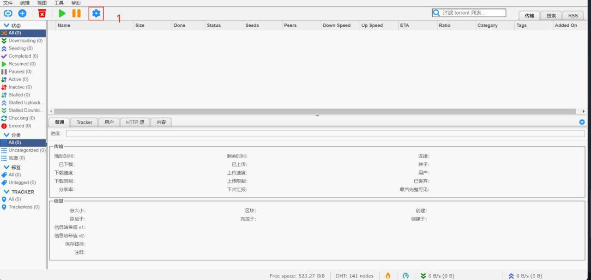
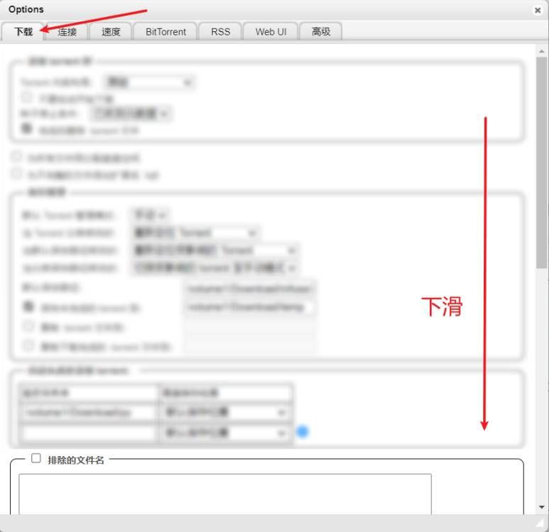
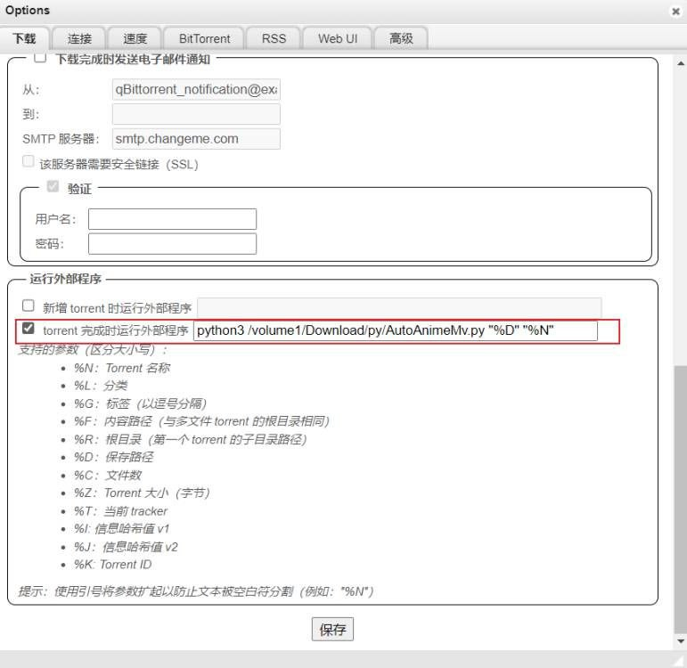

<div align="center">
  <a href="https://github.com/Abcuders/AutoAnimeMv"></a>
  
  **AutoAnimeMV is an ultra-lightweight and fast-deployment tool for automatic identification, renaming, and collation of anime series. It can be used in conjunction with QBittorrent to achieve automatic downloading of anime series and automated file collation.**
  
  **English | [简体中文](./README.md)**

[](https://github.com/Abcuders/AutoCartoonMv/LICENSE) [](https://github.com/Abcuders/AutoAnimeMv/releases/) [](https://t.me/AutoAnimeMv)
</div>

---
# Features
- [x] Automatic identification of anime series
- [x] Automatic renaming
- [x] Automated directory collation
- [x] Easy deployment, ready to use

## System Requirements
- [x] Python 3 environment
- [x] Qbittorrent

# Environment Configuration
* ### Python 3 Environment
  * You can download the appropriate version from the [Python official website](https://www.python.org/downloads/windows/) and install it. We recommend installing version 3.9 or above.
  * Python dependencies used: `sys`, `os`, `time`, `re`, `ast` (used in Test.py).
    The above dependencies should not require separate installation.
  * If you encounter the `Fatal error in launcher: Unable to create process using pip` issue when using `pip install` directly, please use `python3 -m pip install`.

# 🚀Quick Start

> 

> 

> 

 Scroll down to find `Run External Program`
 Run External Program and enter the following code as mentioned above.
> /to/your/dir/AutoAnimeMv.py is the path where AutoAnimeMv.py is located
``` bash
python3 /to/your/dir/AutoAnimeMv.py "%D" "%N" "%L"(Optional)
```
> # Common Questions && Help
* In Synology NAS, the `python3` environment installed through Package Center may encounter various issues. Please use a third-party package source (Note: For the third-party source, you need to manually create a symbolic link for `python3` to /usr/local/bin/python3).

* If you are using the `Docker` version of `QBitTorrent` on Synology NAS, you can directly view the log information output by `AutoCartoonMv.py` in the container logs.

* If you need RSS or BT or anime support, you can come to our Tg group to find help

> # Tool Processing Logic
  * After starting the Run, it will automatically identify the video file format, anime series, truncate the file name, remove irrelevant text, filter out subtitles groups, preserve the series name and season, and rename the video file as `S01Eepisode.Format` before moving it to the `download path` in the `Series\Season_X` folder (it will be created automatically if it doesn't exist) as shown below:
    ```
    [ANi] 无神世界的神明活动（仅限港澳台地区） - 01 [1080P][Bilibili][WEB-DL]  [AAC AVC][CHT CHS][MP4].MP4
    >>无神世界的神明活动/Season_01/S01E01.mp4
    ```
* We have commented out the functionality to determine whether it belongs to the "anime" category. Now it is an optional feature, and you can set different video saving paths based on different types.

* At the same time, a log file named with the current timestamp will be generated in the script directory. Its content includes:
     ```
     Sun_May_28_02-16-36_2023.log
     ```
     ```
    LOG开始记录，完整log条目为8条
    1.接受到['.\\AutoAnimeMv.py', 'E:\\D\\Test', '[DMG&LoliHouse] Kono Subarashil Sekai ni Bakuen wo! - 01 [WebRip 1080p HEVC-10bit AAC ASSx2].mkv']参数
    2.匹配剧集为01
    3.通过剧集截断文件名为=DMG&LoliHouse=-Kono-Subarashil-Sekai-ni-Bakuen-wo=---
    4.番剧Name为Kono-Subarashil-Sekai-ni-Bakuen-wo
    5-4.TrueVideoName=Kono-Subarashil-Sekai-ni-Bakuen-wo,Season=01
    6.当前操作系统识别码为nt,posix/nt/java对应linux/windows/java虚拟机
    7.创建Kono-Subarashil-Sekai-ni-Bakuen-wo\Season_01完成
    8.创建E:\D\Test\Kono-Subarashil-Sekai-ni-Bakuen-wo\Season_01\S01E01.mkv完成 
    ```
> # Testing Tool
* Starting from `v1.5.0`, you can use `Test.py` to perform BT recognition testing on `AutoCartoonMv.py`. Here are the instructions for using `Test.py`:
* `Test.py` doesn't require any parameters, but it needs a `tese` file with the following content:

  ```json
  {"Bt":"","Name":"","Season":"","Episodes":"","FileType":""}
  ```  
  > `Bt` parameter is the name of the bt `Name` parameter is the name of Anime `Season` is the Season of Anime `Episodes` is the number of episodes `FileType` is the video file format

* For example, here is an example of a valid test format. You can also write multiple lines of test data:
  ```json
  {"Bt":"[DMG&LoliHouse] Kono Subarashil Sekai ni Bakuen wo! - 01 [WebRip 1080p HEVC-10bit AAC ASSx2].mkv","Name":"Kono Subarashil Sekai ni Bakuen wo","Season":"01","Episodes":"01","FileType":".mkv"}
  ```
* To perform the test, execute the following code.
  ```
  python3 Test.py 
  ```
* OUTPUT:
    ```
  现在进入Test mode,正在read test文件
  2.匹配剧集为01
  3.通过剧集截断文件名为=DMG&LoliHouse=-Kono-Subarashil-Sekai-ni-Bakuen-wo=---
  4.番剧Name为Kono-Subarashil-Sekai-ni-Bakuen-wo
  Kono-Subarashil-Sekai-ni-Bakuen-wo 01
  5-4.TrueVideoName=Kono-Subarashil-Sekai-ni-Bakuen-wo,Season=01
  01 01 Kono-Subarashil-Sekai-ni-Bakuen-wo .mkv
  {'Bt': '[DMG&LoliHouse] Kono Subarashil Sekai ni Bakuen wo! - 01 [WebRip 1080p HEVC-10bit AAC ASSx2].mkv', 'Name': 'Kono Subarashil Sekai ni Bakuen wo', 'Season': '01', 'Episodes': '01', 'FileType': '.mkv'}....Ok
    ```
# Contributors✨
**Thank you to these fun and awesome people!!!**
> If you want to contribute to this project, you can directly come to [Issues](https://github.com/Abcuders/AutoAnimeMv/issues) with your valuable suggestions or @ me to ask what you can help do!

<a href="https://github.com/wzfdgh">
 
</a>
<a href="https://github.com/Nanako718">

</a>

# Statement
**Any use of this tool for direct or indirect illegal profit-making activities is not authorized and is not supported or endorsed.**

